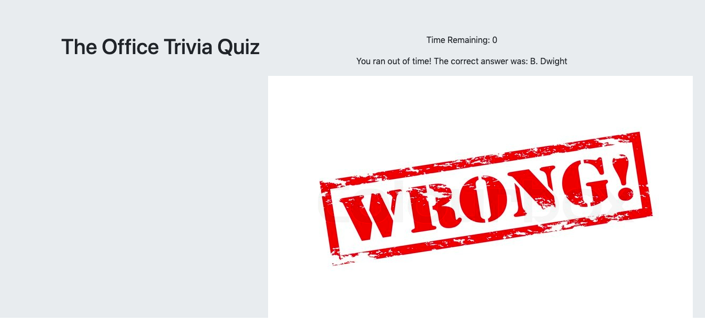

# TriviaGame

## How the Game works :

### It is a trivia game that shows only one question until the player answers it or their time runs out.If the player selects the correct answer, a screen congratulating them for choosing the right option is shown . After a few seconds the next question is displayed.

### If the player runs out of time, time's up is displayed along with the correct answer. After a few seconds, the  next question is displayed.

### If the player chooses the wrong answer, a screen displaying that they selected the wrong option along with the correct answer is displayed. 

## Built with :

* [HTML](https://www.w3schools.com/html/html_intro.asp) 

* [JavaScript](https://www.w3schools.com/js/js_intro.asp)

* [CSS](https://www.w3schools.com/css/css_intro.asp)

## Authors

* [Raghav Shiv](https://github.com/rshiv7)

### [Click to Play]( https://github.com/rshiv7/TriviaGame)